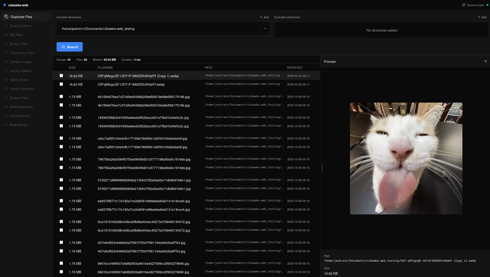

# czkawka-web

A lightning-fast, minimalist web frontend for the [Czkawka](https://github.com/qarmin/czkawka) duplicate file finder.

I built this because I wanted to run Czkawka on my server, but I needed a good UI and easy Docker deployment for it.

> [!IMPORTANT]
> This project is still in early development. Expect bugs, missing features, and breaking changes.

## Tech Stack
This project is built with an emphasis on zero bloat and high performance.

* **Backend:** [Rust](https://www.rust-lang.org/) + [Axum](https://github.com/tokio-rs/axum)
* **Frontend:** [SvelteKit](https://kit.svelte.dev/)
* [Bun](https://bun.sh/)
* [Mise](https://mise.jdx.dev/)

## Acknowledgments
A huge thanks to [qarmin](https://github.com/qarmin) for creating and maintaining [czkawka](https://github.com/qarmin/czkawka). This project wouldn't be possible without the incredible work put into that amazing project.
