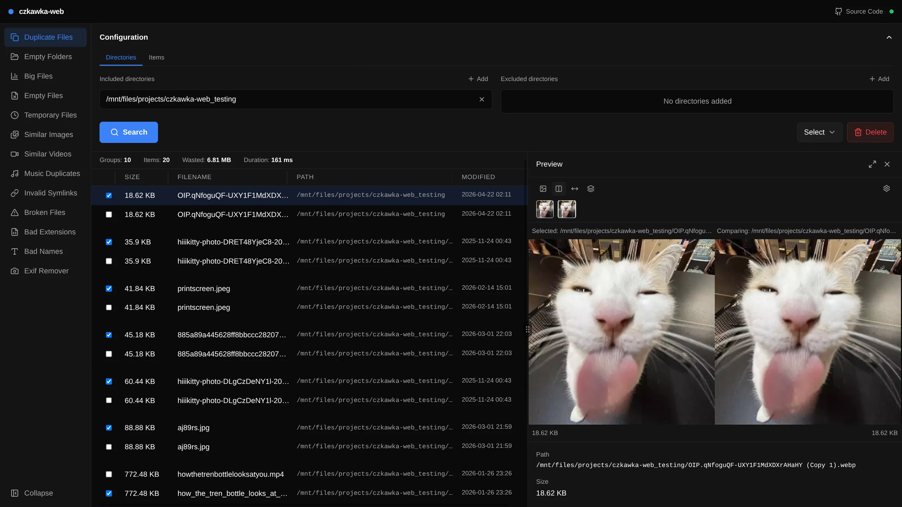

# czkawka-web

A lightning-fast, minimalist web frontend for the [Czkawka](https://github.com/qarmin/czkawka) duplicate file finder.

I built this because I wanted to run Czkawka on my server, but I needed a good UI and easy Docker deployment for it.

> [!IMPORTANT]
> This project is still in early development. Expect bugs, missing features, and breaking changes.



## Tech Stack
This project is built with an emphasis on zero bloat and high performance.

* **Backend:** [Rust](https://www.rust-lang.org/) + [Axum](https://github.com/tokio-rs/axum)
* **Frontend:** [SvelteKit](https://kit.svelte.dev/)
* [Bun](https://bun.sh/)
* [Mise](https://mise.jdx.dev/)

## Docker

You can build and run the entire stack in a single container.

### Build

```bash
docker build -t czkawka-web .
```

### Run

```bash
docker run -d \
  --name czkawka-web \
  -p 3000:3000 \
  -v czkawka-web-data:/data \
  -v /path/to/your/files:/mnt/files \
  ghcr.io/jackra1n/czkawka-web
```

### Docker Compose

```bash
docker compose up -d
```

The included `compose.yaml` maps port `3000` and creates a named volume for state persistence. Mount any directories you want to scan as additional volumes.

### Development / Local Build

If you want to build the image locally from source instead of using the pre-built one, use the development compose file:

```bash
cp .env.example .env
# Edit .env and set SCAN_PATH to the directory you want to scan
docker compose -f compose.dev.yaml up -d
```

### Volumes

| Path | Purpose |
|------|---------|
| `/data` | State persistence (`state.json`, config cache). The container runs as UID `1000` and sets `HOME=/data`. |
| `/mnt/files` (example) | Directories you want to scan. Mount as many as you need; the UI will let you browse any path visible inside the container. |

## Acknowledgments
A huge thanks to [qarmin](https://github.com/qarmin) for creating and maintaining [czkawka](https://github.com/qarmin/czkawka). This project wouldn't be possible without the incredible work put into that amazing project.
